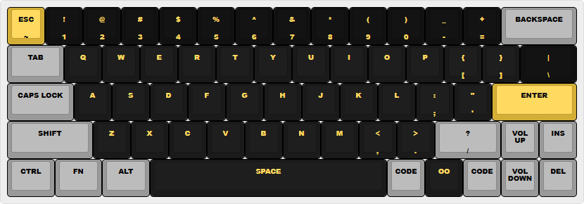
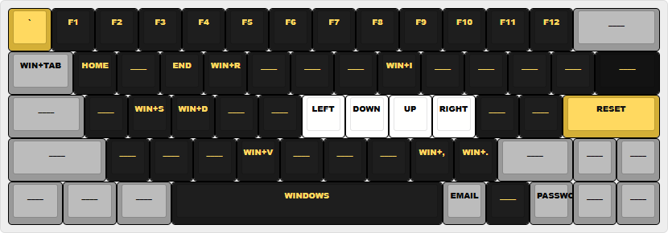
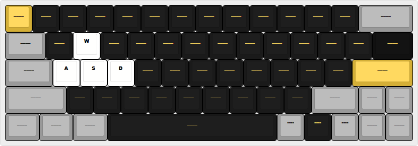

# DZ60RGB V2.1

## Layer

### Base Layer (L0)

Gõ phím cơ bản.



### Function Layer (L1)

F1-F12, VIM navigation. Giữ phím `Fn`.



### Gaming Layer (L2)

Tự động [counter strafe](https://www.youtube.com/shorts/kIm6tcTKiAc). Nhấn `Fn + OO` để toggle.



---

## Cấu hình (Specs)

| Linh kiện | Mô tả |
| :--- | :--- |
| **Kit** | [Tofu60 Redux](https://kbdfans.com/products/tofu60-redux-kit-1) |
| **PCB** | [DZ60RGB V2.1](https://kbdfans.com/products/dz60rgb-hot-swap-custom-keyboard-pcb) |
| **Plate** | [Tofu60 Plate](https://kbdfans.com/collections/tofu60-redux/products/tofu60-redux-accessories) |
| **Stab** | [Cherry Screw-in](https://kbdfans.com/collections/keyboard-stabilizer/products/cherry-screw-in-stabilizer) |
| **Keycap** | [SA Aifei Black Gold](https://kicap.vn/bo-keycap-sa-aifei-black-gold) |
| **Switch** | [HMX Pink Peach](https://kicap.vn/switch-hmx-pink-peach-linear-silent) |

---

## Build & Flash

### 1. Build

Cần cài [QMK MSYS](https://github.com/qmk/qmk_distro_msys/releases/latest).

```bash
qmk setup
cd qmk_firmware/keyboards/dztech/dz60rgb/keymaps/
git clone https://github.com/ovftank/qmk-dz60rgb-v2.1.git ovftank
qmk compile -j 0 -kb dztech/dz60rgb/v2_1 -km ovftank
```

### 2. Flash

1. Giữ **Esc** khi cắm cáp để vào Bootloader.
2. Xóa `FLASH.BIN` trong ổ **KBDFANS**, copy file `.bin` mới vào.
3. **Eject (bắt buộc)**, rút cáp cắm lại.
